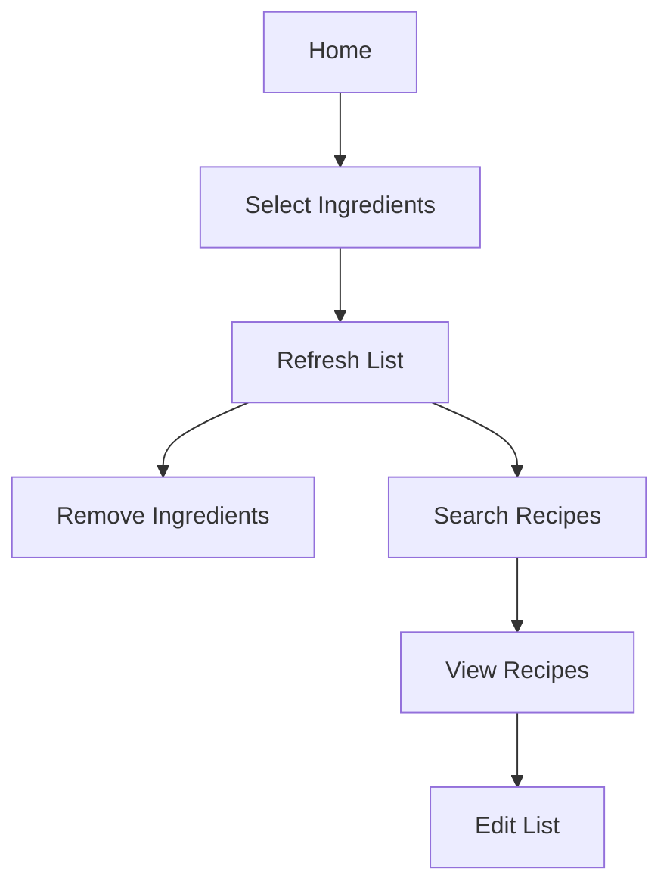

# 🟢 Formação - Vue.js: Do Zero à Mastery

> **Plataforma:** [Alura](https://www.alura.com.br)  
> **Carga Horária Total:** 30h+ (em andamento)  
> **Descrição:**  
O Vue.js é um framework JavaScript progressivo conhecido por sua facilidade de uso, eficiência e escalabilidade. Nesta formação, estou aprendendo a construir aplicações web dinâmicas e reativas utilizando Vue.js 3, desde conceitos fundamentais até técnicas avançadas. A formação abrange todo o ciclo de desenvolvimento, desde a criação de componentes básicos até o gerenciamento de estado com Vuex e o uso da Composition API.

---

## 📚 Conteúdo da Formação  

### 1️⃣ **Vue 3: Entendendo Componentes, Diretivas e Reatividade no Framework** ✅  
> **⏱ Carga Horária:** 10h  
> **📝 Descrição:**  
Curso introdutório ao Vue.js 3, apresentando os conceitos fundamentais do framework e a construção de uma aplicação completa.  

**✨ Projeto Desenvolvido:**  
- 🍽️ **Cookin' UP**: Uma aplicação para buscar receitas com base nos ingredientes disponíveis, implementada com Vue.js 3 e TypeScript.
- 🌐 **[Acesse o Deploy](https://cookin.floresdev.com.br)**

**🔑 Tópicos abordados:**  
- Criação de projetos Vue.js do zero com configuração TypeScript
- Desenvolvimento de componentes reutilizáveis
- Utilização de diretivas como v-if, v-for, v-bind e v-on
- Conceitos de estado e reatividade no Vue
- Comunicação entre componentes com props e eventos
- Métodos de ciclo de vida de componentes
- Integração do TypeScript para segurança de tipos

**📌 Melhorias Adicionadas:**
- 🌍 **Internacionalização** com Vue-i18n para suporte a múltiplos idiomas
- 🔄 **Gerenciamento de estado global** utilizando Vuex para compartilhamento eficiente de dados

**[🔗 Certificado de conclusão](https://cursos.alura.com.br/certificate/e5ec5b07-433f-4413-ab6f-3ee46d57bce1?lang=pt_BR)**  

---

### 2️⃣ **Vue 3: Explorando o Framework** ⏳ (Em andamento)  
> **⏱ Carga Horária:** 10h  
> **📝 Descrição:**  
Aprofundamento nos conceitos do Vue.js 3 através do desenvolvimento de uma nova aplicação chamada Alura Tracker.  

**✨ Projeto em Desenvolvimento:**  
- ⏱️ **Alura Tracker**: Uma aplicação para rastreamento de tempo dedicado a diferentes tarefas.

**🔑 Tópicos abordados:**  
- Reforço dos conceitos fundamentais do Vue.js 3
- Criação de projetos mais complexos
- Exploração de novas situações e casos de uso
- Desenvolvimento de interfaces dinâmicas e responsivas

---

### 3️⃣ **Vue 3: Composition API e Vuex** 🕒 (Próximo curso)  
> **⏱ Carga Horária:** 10h+  
> **📝 Descrição:**  
Exploração de conceitos avançados do Vue.js 3, incluindo a Composition API e o gerenciamento de estado com Vuex.  

**✨ Projeto Planejado:**  
- Expansão do **Alura Tracker** com novas funcionalidades

**🔑 Tópicos a serem abordados:**  
- Implementação da Composition API para escrita de componentes
- Gerenciamento avançado de estado com Vuex
- Vuex modular para aplicações escaláveis
- Sincronismo entre estado local e global
- Técnicas avançadas de desenvolvimento Vue

---

## 🎯 Objetivos da Formação  
- 🖥️ Dominar o framework Vue.js 3 e seus conceitos principais
- 🧩 Criar componentes reutilizáveis e bem estruturados
- 🔄 Entender e aplicar o gerenciamento de estado em aplicações Vue
- 🧠 Utilizar a Composition API para estruturar lógica complexa
- 📱 Desenvolver aplicações responsivas e dinâmicas para o usuário final

## 🚀 Resultados Obtidos e Esperados  
- ✅ Criação de uma aplicação completa (Cookin'UP) implementada com Vue.js 3 e TypeScript
- ✅ Adição de funcionalidades avançadas como internacionalização e gerenciamento de estado
- 🔄 Em progresso: Desenvolvimento do Alura Tracker para aprofundar conhecimentos
- 🔜 Próximo: Domínio da Composition API e técnicas avançadas de gerenciamento de estado

---

## 📂 GitHub e Projetos

### Cookin'UP
Um aplicativo web que ajuda os usuários a encontrar receitas com base nos ingredientes disponíveis em casa.

**Fluxo básico do projeto:**

**Tecnologias utilizadas:**
- Vue.js 3
- TypeScript
- Vue-i18n para internacionalização
- Vuex para gerenciamento de estado
- HTML5/CSS3

**Repositório:** [GitHub - Cookin'UP](https://github.com/FernandoAurelius/cookin-up)  
**Demo:** [Cookin'UP Live Demo](https://cookin.floresdev.com.br)

---

📄 **Certificados Incluídos:**  
- [📜 Vue 3: Entendendo Componentes, Diretivas e Reatividade no Framework](https://cursos.alura.com.br/certificate/e5ec5b07-433f-4413-ab6f-3ee46d57bce1?lang=pt_BR) ✅
- [📜 Vue 3: Explorando o Framework] (em andamento) ⏳
- [📜 Vue 3: Composition API e Vuex] (futuro) 🕒
